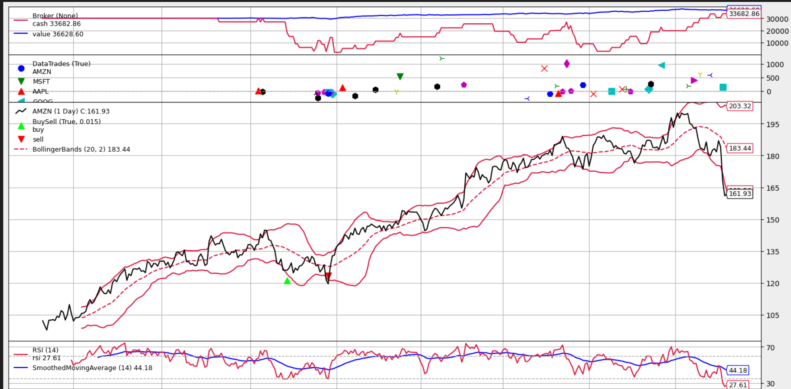
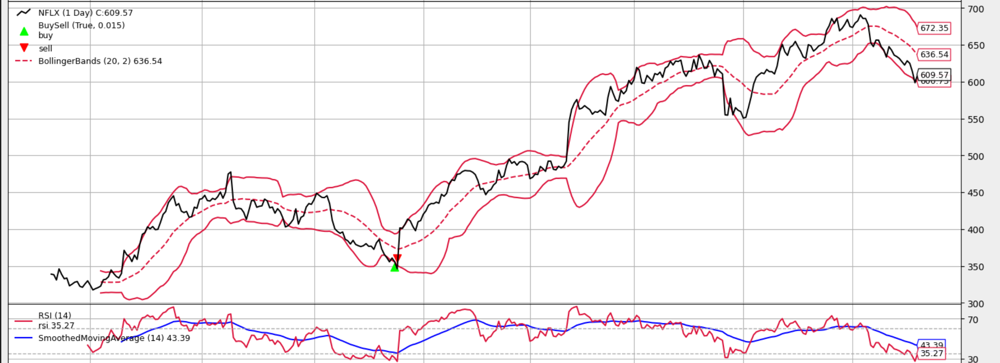
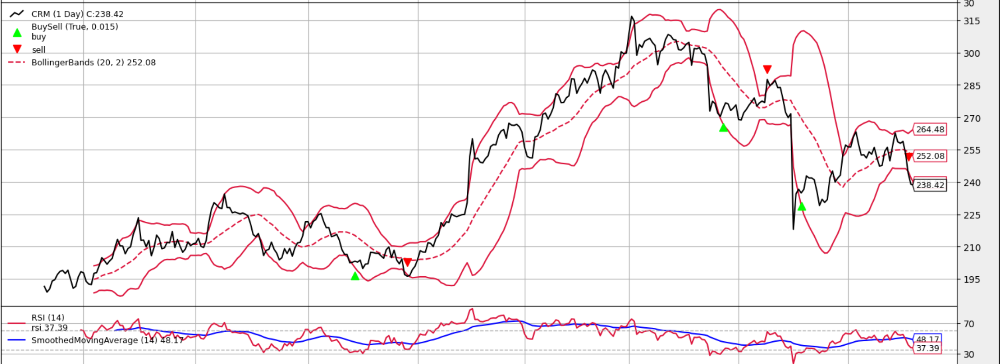
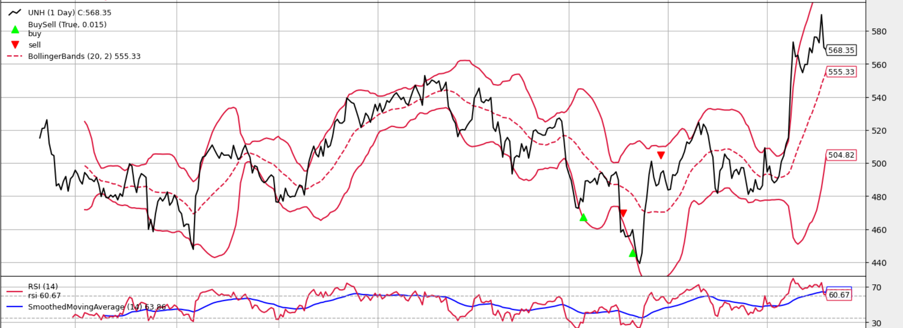
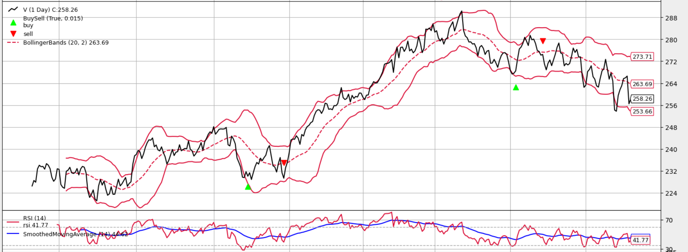
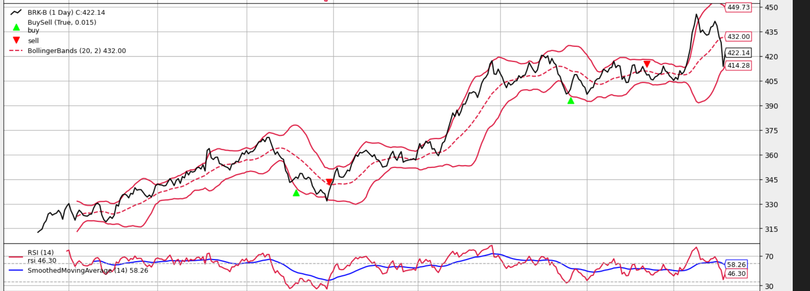
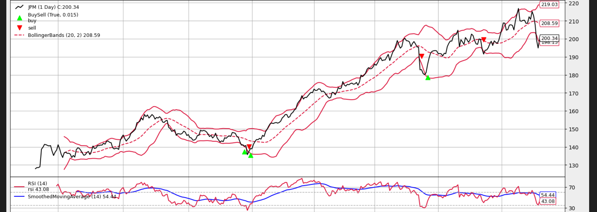
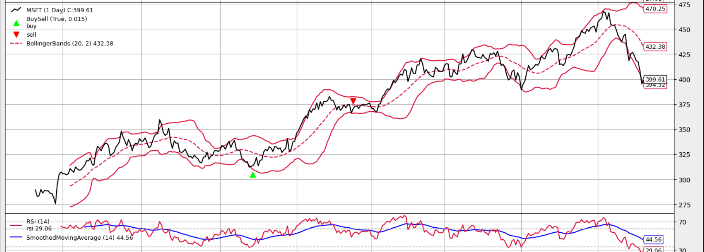
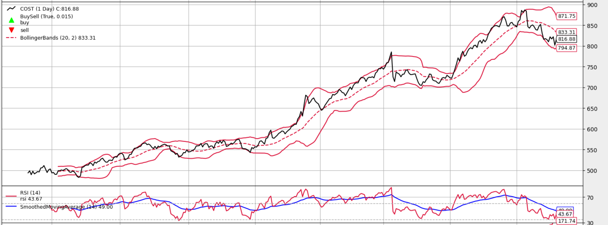

# Optimisation strategy as of 2024-08-08

Current strategy

Buys when:
* bb-bot is crossed upwards and RSI below 40

Sells when:
* bb-mid hat (^) shape
* or price boes below bb-low

Optimisation opportunities below

## 1. Tolerance to low magnitude and sustain of bb-low crossover

## 2. Tolerance to bb-mid inflection when variance of price is low (measurable in inflection downswing?) 

## 3. Analyse why COST did not trigger buy

